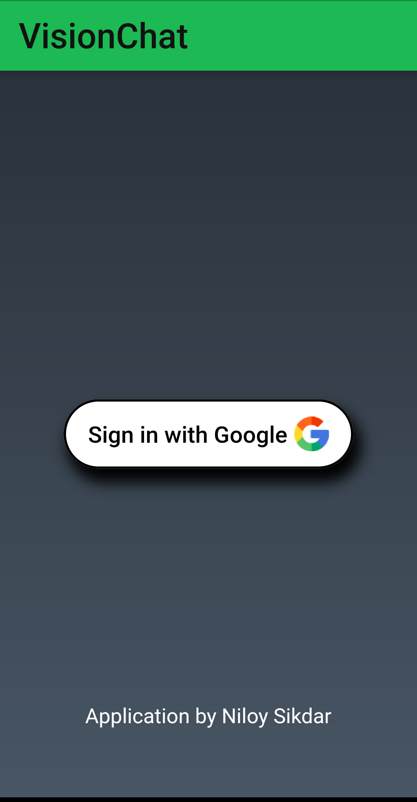
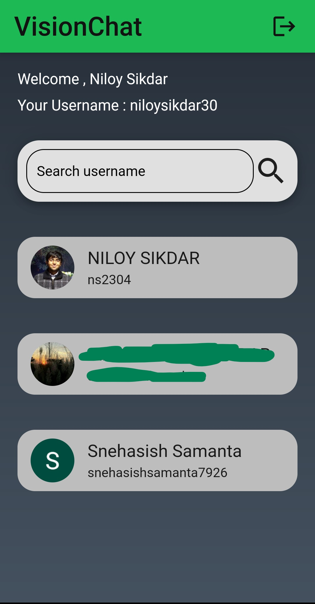
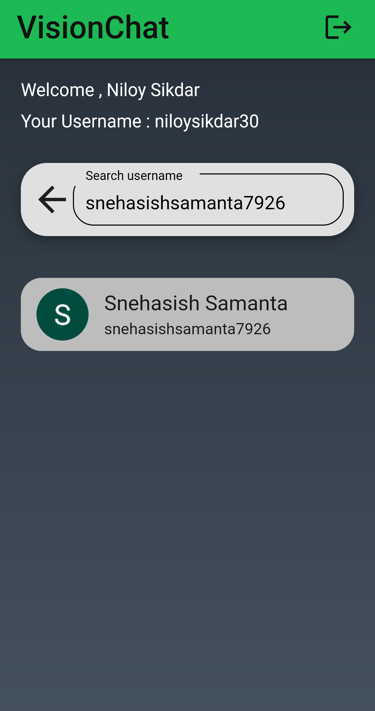
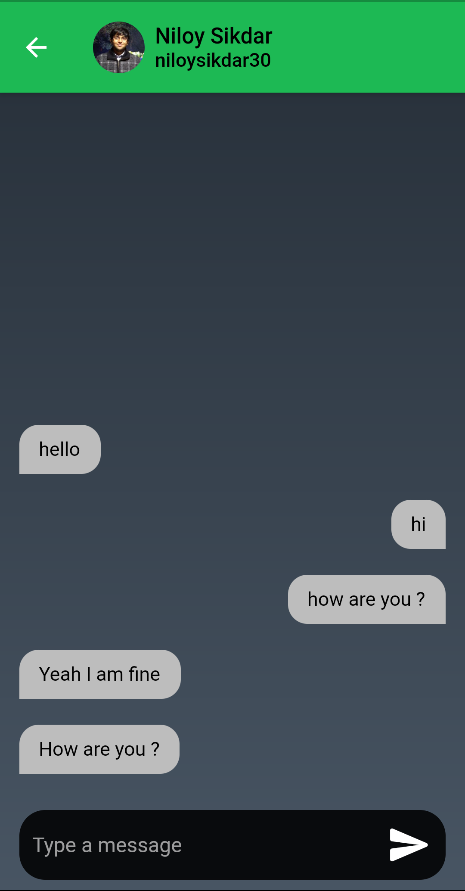

# VisionChat

<!--  -->

---

### Table of Contents

- [Description](#description)
- [Tech Stack](#Tech-Stack)
- [Getting Started](#Getting-Started)
- [Author Info](#author-info)

---

## Description

**VisionChat is an user-oriented communication app which provides you a realtime texting environment, enabling people to get insights into what someone is typing while talking to them. With a single-tap SignUp process, you will find yourself becoming a part of the community where you can find other registered users on the app with a global search. Customize your profile and go 🎉**

## Tech Stack

- Flutter
- Firebase

[Back To The Top](#VisionChat)

---

## Getting Started

This project is a starting point for a Flutter application.

A few resources to get you started if this is your first Flutter project:

- [Lab: Write your first Flutter app](https://flutter.dev/docs/get-started/codelab)
- [Cookbook: Useful Flutter samples](https://flutter.dev/docs/cookbook)

For help getting started with Flutter, view our
[online documentation](https://flutter.dev/docs), which offers tutorials,
samples, guidance on mobile development, and a full API reference.

[Back To The Top](#VisionChat)

---

## Author Info

- LinkedIn - [Niloy Sikdar](https://www.linkedin.com/in/niloysikdar/)
- GitHub - [Niloy Sikdar](https://github.com/niloysikdar)

[Back To The Top](#VisionChat)